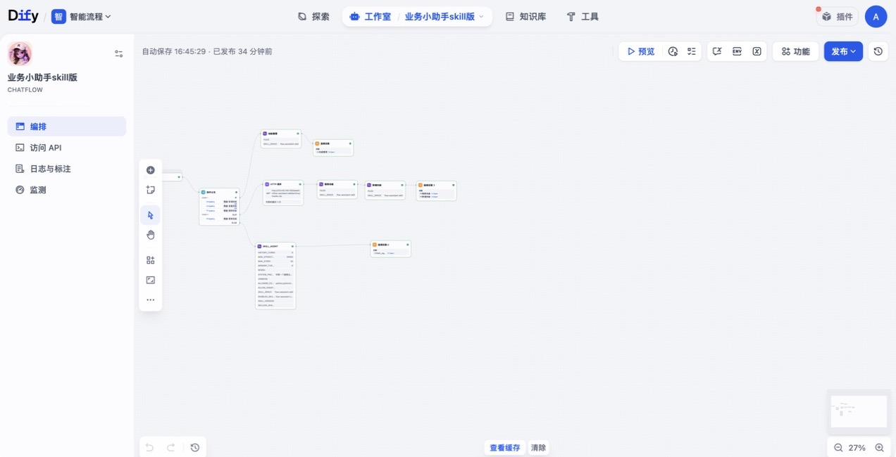
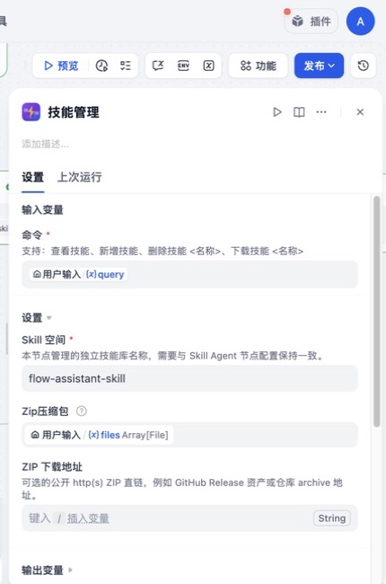

# Skill Agent 完整使用说明

**版本：** 0.2.32 · **类型：** Dify 工具插件 · **许可证：** Apache-2.0
**作者：** [liux297](https://github.com/liux297) · **项目地址：** https://github.com/liux297/skill_agent

[English README](../README.md) · [操作场景手册](../GUIDE.md) · [隐私说明](../PRIVACY.md)

Skill Agent 可以把包含 `SKILL.md` 的目录变成 Dify 工作流可复用的能力。工作流可以安装、隔离和管理技能；大模型只按需读取技能说明和资源，在受控范围内执行命令，实时输出执行进度，并返回最终文本或生成文件。

## 插件提供的两个工具

| 工具 | 用途 | 推荐所在分支 |
|---|---|---|
| **技能管理（Skill Manager）** | 查看、新增、删除、下载某个 Skill Space 中的技能 | 管理或更新分支 |
| **Skill Agent** | 选择技能、遵循 `SKILL.md`、调用受控工具并生成最终回答/文件 | 普通用户问答分支 |

每个工作流都可以选择一个 **Skill Space（技能空间）**。空间名称不同，技能目录、历史记录键和临时会话目录都会隔离；也可以按需加载 `shared` 公共只读空间。

## 本文使用的示例工作流

以下截图来自 Dify 中的 **“业务小助手 skill 版”** Chatflow。这个流程把技能管理、Git 更新和普通业务问答分开，并在独立的 `flow-assistant-skill` 空间中运行一个业务技能。



流程路由如下：

| 条件 | 执行节点 | 结果 |
|---|---|---|
| 用户输入包含 `查看技能`、`新增技能`、`删除技能` 或 `下载技能` | 技能管理 → 直接回复 | 确定性的技能管理操作 |
| 用户输入包含 `更新技能` | 下载 ZIP → 删除旧技能 → 新增新技能 → 直接回复 | 从 Git/Release 压缩包部署新技能 |
| 其他输入 | Skill Agent → 直接回复 | 返回业务回答和可能生成的文件 |

推荐采用这种分支结构：终端用户的问题交给 Skill Agent；安装、删除等管理操作放在明确的工作流分支中。

## 一、安装插件

在 Dify 市场安装 Skill Agent，或在插件页面上传 `.difypkg` 文件。

自托管 Dify 需要确保上传文件生成的 URL 能被插件守护进程访问。如果上传或下载失败，请检查 Dify 的公开/基础文件地址，以及 Dify 与插件运行环境之间的网络连通性。

## 二、准备工作流输入

按需要在开始节点创建以下变量：

| 变量 | 类型 | 用途 |
|---|---|---|
| `query` | String | 用户问题或技能管理命令 |
| `files` | Array[File] | 上传技能 ZIP，或上传需要 Skill Agent 处理的文件 |
| `current_user` 或其他身份字段 | String | 通过 `custom_variables` 传给技能的当前用户 |

把 `query` 和 `files` 分别连接到插件对应输入。示例流程将用户身份转换成 JSON 后传给 `custom_variables`。

## 三、配置技能管理节点



### 参数说明

| 参数 | 必填 | 用法 |
|---|---:|---|
| `command` | 是 | 映射用户输入，或填写固定命令，例如 `查看技能` |
| `skill_space` | 是 | 要管理的技能空间；必须与 Skill Agent 使用相同值 |
| `files` | 否 | `新增技能` 使用的 ZIP 文件；同时存在时优先于 `archive_url` |
| `archive_url` | 否 | 没有上传文件时使用的公开、无凭证 `http(s)` ZIP 直链 |

示例工作流将 `skill_space` 配置为 `flow-assistant-skill`。

### 支持的命令

| 功能 | 命令示例 | 实际行为 |
|---|---|---|
| 查看技能 | `查看技能` | 列出当前空间中稳定的技能目录名称 |
| 新增技能 | `新增技能` | 从上传 ZIP 或 `archive_url` 安装一个或多个技能目录 |
| 删除技能 | `删除技能 flow-assistant-skill` | 按目录名称删除技能 |
| 下载技能 | `下载技能 flow-assistant-skill` | 把指定技能打包成 ZIP 返回 |

兼容命令：`存入技能`、`保存技能` 等价于新增；`查看`、`查看 技能` 等价于查看技能。

需要注意：

- 新增技能不会覆盖同名目录；更新时应先删除旧技能，或安装到新的 Skill Space。
- 删除和下载必须使用技能目录名称，不使用会变化的序号。
- ZIP 解压会拦截绝对路径、路径穿越、文件数量过多和解压后体积过大。
- `archive_url` 只能使用不包含账号密码的公开 `http(s)` 地址，并受上传大小限制保护。

## 四、制作合格的技能包

常见 ZIP 结构如下：

```text
flow-assistant-skill/
├── SKILL.md
├── Reference/
│   └── process-notes.md
└── Scripts/
    └── query_project.py
```

`SKILL.md` 是技能入口。需要固定技能版本时，建议使用 YAML frontmatter：

```markdown
---
name: flow-assistant-skill
description: 查询业务流程、项目、待办和业务单。
version: 2.7.0
---

# 执行要求

1. 只读取当前问题需要的参考资料。
2. 项目实时数据必须执行 `python Scripts/query_project.py ...` 查询。
3. 用简洁表格回答，缺失字段不得猜测。
```

技能说明中使用相对路径。需要交付给用户的文件应写入本次临时会话目录，并明确标记/导出为最终文件。

## 五、配置 Skill Agent 节点


### 全部参数

| 参数 | 必填 | 默认值 | 用法 |
|---|---:|---:|---|
| `query` | 是 | — | 用户问题或任务 |
| `files` | 否 | — | 交给技能读取或转换的上传文件 |
| `custom_variables` | 否 | — | 注入 Agent 上下文、技能模板和子进程环境的 JSON 对象 |
| `skill_space` | 是 | `default` | 当前工作流使用的独立技能库 |
| `enabled_skills` | 否 | 全部 | 逗号分隔的技能目录白名单 |
| `skill_version` | 否 | — | 只启用一个技能时的预期版本；不一致就停止执行 |
| `include_shared_skills` | 是 | `false` | 加载 `shared` 公共只读空间；同名时私有空间优先 |
| `model` | 是 | — | 用于规划和工具调用的 Dify 对话模型 |
| `max_steps` | 是 | `15` | 单次调用最多执行的推理/工具轮数 |
| `memory_turns` | 是 | `12` | 单次调用内部保留的最近消息轮数 |
| `system_prompt` | 否 | 内置 | 覆盖/增强默认行为的简短领域约束 |
| `verbose` | 是 | `false` | 调试时显示命令、路径、参数、标准输出和错误 |
| `history_turns` | 是 | `3` | 跨调用注入的历史原文轮数；`0` 表示关闭 |
| `max_stdout_chars` | 是 | `30000` | 单条命令输出压缩/截断前的最大字符数 |
| `allowed_commands` | 否 | 安全默认值 | 允许运行的可执行程序，逗号分隔 |
| `allow_unsafe_commands` | 是 | `false` | 是否允许显式列出的 shell、包管理器、Git 和网络客户端 |

### 示例工作流的推荐配置

| 配置 | 示例值 | 原因 |
|---|---|---|
| `skill_space` | `flow-assistant-skill` | 隔离当前工作流的业务技能 |
| `enabled_skills` | `flow-assistant-skill` | 避免误选其他技能 |
| `include_shared_skills` | `false` | 保持生产结果稳定 |
| `max_steps` | `30` | 允许完成多接口组合查询 |
| `memory_turns` | `6` | 控制单次执行上下文大小 |
| `history_turns` | `8` | 保留近期对话连续性 |
| `max_stdout_chars` | `30000` | 适合常规结构化接口数据 |
| `verbose` | `false` | 面向用户只展示简洁步骤 |
| `allow_unsafe_commands` | 除非必要否则 `false` | 默认更安全 |

### 自定义变量与当前用户

传入 JSON，例如：

```json
{"iv-user":"${current_user}"}
```

变量可以通过三种方式使用：

- 技能调用 `get_session_context()` 获取会话上下文
- 在 `SKILL.md` 等技能文本中使用 `${iv-user}` 占位符
- 在子进程中读取净化后的环境变量，例如 `IV_USER`

如果工作流已经传入当前用户，应直接将其作为当前用户使用。只有变量确实缺失时才向终端用户询问，不能重复让用户确认身份。

### 技能选择、公共技能与版本锁定

- `enabled_skills` 留空：当前私有空间内的全部技能都可被发现。
- 填写逗号分隔名称：只允许发现和执行这些目录。
- 填写 `skill_version` 时，`enabled_skills` 必须且只能有一个技能。
- 版本可声明在 YAML frontmatter，或写成 `SKILL.md` 中明确的版本行。
- 开启 `include_shared_skills` 后，先使用当前私有空间；找不到时再读取 `shared`，同名私有技能优先。

### 两类记忆参数

`memory_turns` 与 `history_turns` 作用不同：

- `memory_turns`：控制一次 Skill Agent 调用内部的工作窗口。
- `history_turns`：把同一 Skill Space 上一次调用的用户/助手原文恢复到本次调用。

独立任务可以减小历史轮数；连续对话助手可以适当增大。历史和断点恢复键都按 Skill Space 隔离。

### 命令安全设置

普通模式只识别少量安全命令，例如 `python`、`python3`、`node`、`pandoc`、`soffice`、`pdftoppm`。`allowed_commands` 只能在插件识别的安全/高风险集合内继续收窄，未识别名称会被忽略。

shell、包管理器、Git 和网络客户端只有同时满足以下条件才会放行：

1. 技能完全可信，且运行在自托管环境。
2. `allow_unsafe_commands=true`。
3. 对应可执行程序明确写入 `allowed_commands`。

不要对终端用户可随意上传的技能开启高风险命令模式。

## 六、Skill Agent 实际可以做什么

模型不会获得无限制的文件系统或 shell 权限，只能调用插件定义的运行时工具：

| 能力 | 运行时操作 |
|---|---|
| 发现技能 | 查看已安装技能，读取 `SKILL.md` 元数据 |
| 检查技能 | 查看目录结构，读取相对路径文本文件 |
| 执行技能 | 在指定技能目录中运行允许的命令 |
| 管理会话文件 | 在临时会话中写入、读取、列出和转换文件 |
| 交付文件 | 标记/导出临时文件，并通过插件 `files` 输出返回 |
| 管理已安装技能 | 从会话 ZIP/目录安装、查看、卸载或覆盖更新技能 |
| 获取上下文 | 获取 Skill Space、启用技能、上传文件路径和自定义变量 |

执行过程中会实时流式输出进度。`verbose=false` 时每一步只显示一句面向用户的描述；`verbose=true` 时才显示技术细节。

## 七、连接最终回复

把 Skill Agent 的两个输出都连接到最终回复节点：

- `text`：执行进度和最终回答
- `files`：Markdown、PDF、图片、表格等最终交付文件

普通问答至少返回 `text`；技能可能生成文件时，还要映射 `files`，否则用户无法下载交付物。

## 八、自动更新技能

示例工作流为 `更新技能` 单独创建分支：

1. 下载新的仓库或 Release ZIP。
2. 在目标 Skill Space 执行 `删除技能 <名称>`。
3. 执行 `新增技能`，并传入下载得到的 ZIP。
4. 把删除和新增结果一起返回。

更简单的做法是省略 HTTP 节点，直接在技能管理节点填写公开 ZIP 的 `archive_url`；当 `files` 为空时会使用这个地址。

更新分支中的所有技能管理节点和 Skill Agent 必须使用同一个 `skill_space`。生产更新前建议先在测试 Skill Space 验证新版本。

## 九、系统提示词怎么写

节点级系统提示词应尽量简短。详细执行步骤、接口协议、示例、字段解释和输出规则应写入技能本身。

推荐只保留跨场景约束，例如：

```text
使用已安装技能回答业务流程和实时数据问题。
项目、待办、审批或流程数据必须调用对应接口，缺失值不得编造。
优先用简洁表格或列表给出完整结果。
```

## 十、常见问题

| 现象 | 检查项 |
|---|---|
| ZIP 无法安装 | 地址可访问、体积未超限、压缩包包含带 `SKILL.md` 的技能目录 |
| 提示技能已存在 | 先删除同名目录，或改用新的 Skill Space |
| Agent 找不到技能 | `skill_space`、`enabled_skills` 与目录名称完全一致 |
| 版本校验失败 | 只启用了一个技能，且声明版本与 `skill_version` 一致 |
| 上传文件无法读取 | Dify 生成的文件 URL 可被插件守护进程访问 |
| 命令被拒绝 | 命令被插件识别、位于 `allowed_commands`，高风险命令还需开启对应开关 |
| 输出内容太大 | 调低 `max_stdout_chars`，或让技能先过滤并结构化数据 |
| 多轮对话丢上下文 | 增大 `history_turns`，并确保多次调用使用同一 Skill Space |
| 用户看到太多技术信息 | 关闭 `verbose`，把详细规则从系统提示词移入 `SKILL.md` |

## v0.2.32 更新内容

- 以真实 Dify 工作流为例，从头重写完整操作说明。
- 技能管理新增公开 ZIP 地址安装，便于自动更新分支使用。
- 补齐全部公开参数、管理命令、安全开关和输出方式。
- 删除旧版截图，替换为当前 Skill Space 工作流截图。

## 联系方式

- 作者：[liux297](https://github.com/liux297)
- 邮箱：297218348@qq.com
- 项目地址：https://github.com/liux297/skill_agent
